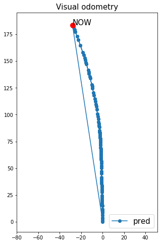

# Monodepth2 Visual Odometry

A repository of how to visualize monodepth2 visual odometry.

## Getting Started

These instructions will get you a copy of the project up and running on your local machine for development and testing purposes. See deployment for notes on how to deploy the project on a live system.

### Prerequisites

What things you need to install the software and how to install them

```
1. opencv
2. numpy
3. torch
4. PIL
5. matplotlib
```

### Running

To run this code just type open anjay.ipynb file in this repository, and type:

```
jupyter notebook
```

## Result


## Authors

* **Ferdyan Dannes** - *Initial work* - [ferdyan's site](www.ferdyandannes.com)

See also the list of [contributors](https://github.com/your/project/contributors) who participated in this project.

## License

This project is licensed under the MIT License - see the [LICENSE.md](LICENSE.md) file for details

## Acknowledgments

* Hat tip to anyone whose code was used
* Inspiration
* etc
